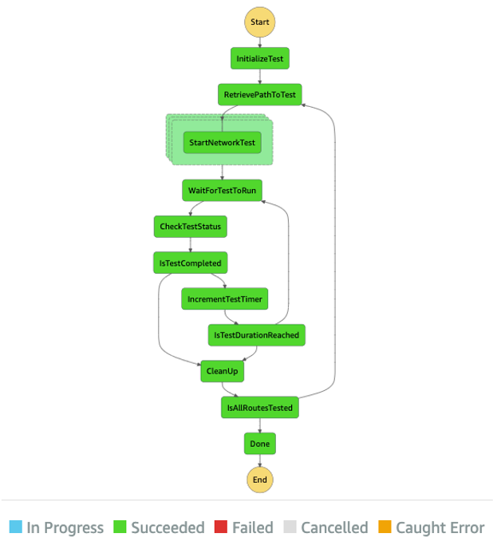
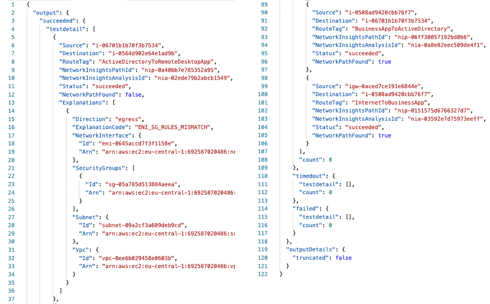

# Infrastructure as Code Network Tester (IaC Network Tester)

This package provides a a tool that helps you run connectivity testing against a set of source and destination resources to ensure configuration matches intent.

For infrastructure deployed via AWS Console, SDK or CLI, the tester can be run post infrastructure deployment by specifying the stack name and the logical identifier of the stack output.

For infrastructure is deployed via a CI/CD pipeline, the tester can be integrated into the testing phase of the pipeline prior to deploying to production.

<p align="center">
  
</p>

## What does the state machine look like?

The state machine is shown in the figure below. The high level logic implemented on the state machine to carry out the test include:

- Identify the routes to be tested by retrieving the JSON formatted output from the stack output
- Start the network test by invoking VPC Reachability Analyzer concurrently for the routes
- Wait for the test to run and retrieve the test results
- Clean up the VPC Reachability Analyzer resources used to carry out the test
- Repeat the process from Step 2 if more than five routes are to be tested (the tool tests in batches of 5 due to the quota for concurrent analyses for VPC Reachability Analyzer)

<p align="center">
  
</p>

## How to deploy the state machine

IaC Network Tester is a SAM application with the lambda functions developed in Python. To deploy the SAM application you can use AWS CloudShell (which comes with AWS CLI, SAM CLI and Python pre-installed). You can also use any other CLI tool but you will need to install the dependencies. See below for instructions

- Install Python and its package manager, pip, if they are not already installed. To download and install the latest version of Python, [visit the Python website](https://www.python.org/).

- Install the latest version of the AWS CLI on your Linux, macOS, Windows, or Unix computer. You can find instructions [here](https://docs.aws.amazon.com/cli/latest/userguide/installing.html).

- [Install SAM CLI](https://docs.aws.amazon.com/serverless-application-model/latest/developerguide/serverless-sam-cli-install.html)

Deploy the IaC Network Tester application on your AWS account:

```bash
sam build
sam deploy --guided
```

## How to do I use IaC Network Tester for my Infrastructure as Code Template

The IaC Network Tester can be used for infrastructure deployed directly via the AWS Console, SDK or CLI. It can also be used for infrastructure deployed via a CI/CD Pipeline. To use the tool for your IaC tempalte, one of the OUTPUTS from the stack must be a JSON formatted array with each item on the array containing the following keys:

- **Source** - The source resource where the traffic will originate
- **Destination** - The destination resource where the traffic will terminate
- **RouteTag** - An identifier for the source and destination route

See sample JSON formatted array below. More routes can be added following the same pattern.

```yaml
Outputs:
  NetworkReachabilityTestPaths:
    Value: !Sub |
      [
      {"Source":"${AppServerInstance}", "Destination":"${InternetGateway}","RouteTag":"AppToInternet"},
      {"Source":"${WebServerInstance}", "Destination":"${InternetGateway}","RouteTag":"WebToInternet"},
      {"Source":"${InternetGateway}", "Destination":"${DBServerInstance}","RouteTag":"InternetToDB"},
      {"Source":"${InternetGateway}", "Destination":"${AppServerInstance}","RouteTag":"InternetToApp"},
      {"Source":"${InternetGateway}", "Destination":"${WebServerInstance}","RouteTag":"InternetToWeb"}
      ]
```

For a detailed walkthrough of how the tool can be used on a sample template, refer to this [blog post](https://aws.amazon.com/blogs/aws/)

## How to execute the state machine

Run the IaC Network Tester state machine by starting a new execution using the command below. The `<state_machine_arn>` parameter is the arn of the IaC Network Tester State Machine.

```bash
aws stepfunctions start-execution \
--state-machine-arn <state_machine_arn> \
--input "{\"stackName\": \"<sample_stack_name>\", \"routeToTestOutputKey\": \"<route_to_test_output_key>\", \"analysisDuration\": 15, \"analysisWaitCount\": 3}"
```

- **stackName** - the name of the CloudFormation stack to test
- **routeToTestOutputKey** - the output key of the CloudFormation stack that contains the JSON formatted string for the route to test
- **analysisDuration** - the duration in seconds which specifies the time to wait for the VPC Reachability Analysis to run after initiating the analysis.
- **analysisWaitCount** - the number of times to wait for the analysis to run if after the `analysisDuration` the test is still running. Each wait is the duration specified in `analysisDuration`.

## What results can I expect from IaC Network Tester?

A sample output from the IaC Network Tester state machine is shown below. It is a JSON formatted string that shows the tests that succeeded, timed out (if the analysis did not complete within the configured time) or failed. For each route tested, the results show the Source, Destination and the RouteTag which were specified in the input. Apart from these, additional parameters such as NetworkInsightsPathId, NetworkInsightsAnalysisId, are identifiers of internal analysis objects created. NetworkPathFound and Explanations are details from the VPC Reachability Analysis of each route. NetworkPathFound indicates if the route is reachable and if not the Explanations field provides details of why the route is not reachable

<p align="center">
  
</p>

## Security

See [CONTRIBUTING](CONTRIBUTING.md#security-issue-notifications) for more information.

## License

This library is licensed under the MIT-0 License. See the LICENSE file.
Testing
