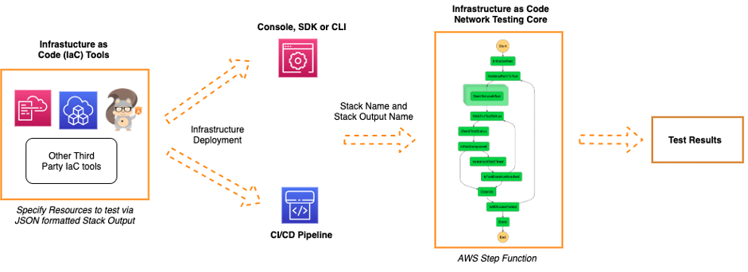

# Infrastructure as Code Network Tester

This package provides a a tool that helps you run network testing against a set of source and destination resources to ensure configuration matches intent.

For infrastructure deployed via AWS Console, SDK or CLI, the tester can be run post infrastructure deployment by specifying the stack name and the logical identifier of the stack output.

For infrastructure is deployed via a CI/CD pipeline, the tester can be integrated into the testing phase of the pipeline prior to deploying to production.

<p align="center">
  
</p>

The tester will execute the networking testing by running a step function that carries out the following steps:

- Identify the routes to be tested by retrieving the JSON formatted output from the stack output
- Start the network test by invoking VPC Reachability Analyzer for each of the routes
- Wait for the test to run and retrieve the test results
- Clean up the VPC Reachability Analyzer resources used to carry out the test

The output from the state machine indicates the results of the test, indicating routes that are reachable and unreachable. For existing deployments this can be used to test or diagnose the configuration of deployed resources. For infrastructure deployed via CI/CD pipeline, this result can be used to ensure the configuration matches intent and if not fail the pipeline and prevent deploying into production.

## Prerequisites

Before you can use IaC Network Tester, you must:

- Install Python and its package manager, pip, if they are not already installed. To download and install the latest version of Python, [visit the Python website](https://www.python.org/).
- Install the latest version of the AWS CLI on your Linux, macOS, Windows, or Unix computer. You can find instructions [here](https://docs.aws.amazon.com/cli/latest/userguide/installing.html).

To get started with the IaC Network tester, use the SAM CLI. SAM CLI provides a Lambda-like execution environment that lets you locally build, test, debug, and deploy applications defined by SAM templates.

- [Install SAM CLI](https://docs.aws.amazon.com/serverless-application-model/latest/developerguide/serverless-sam-cli-install.html)

## Using the IaC Network Tester

There are 2 ways to run the tester. You can run it maually against a specific CloudFormation template. The steps below guide you through this process.

### Step 1.1

Deploy the IaC Network Tester application on your AWS account:

```bash
sam build
sam deploy --guided
```

While running the `sam deploy -—guided` command, specify the `<stack name>` for example `iac-network-tester-app` and for other prompts, select the default by pressing `Enter`.

Note the Amazon Resource Name (ARN) of the IaC Network Tester state machine returned as the value with the key `IaCNetworkTesterStateMachineArn`.

### Step 1.2

Ensure the format of the output of your CloudFormation template:

The key addition to the template to enable the use of IaC Network Tester is the template output with the logical identifier `NetworkReachabilityTestPaths` as shown below. This is a JSON formatted array with each item on the array containing the following keys:

- **Source** - The source resource where the traffic will originate
- **Destination** - The destination resource where the traffic will terminate
- **RouteTag** - An identifier for the source and destination route

More routes can be added following the same pattern however the default for the maximum number of routes that can be analysed concurrently is 6 (can be adjusted using the quota `Reachability Analyzer Concurrent Analyses`).

```yaml
Outputs:
  NetworkReachabilityTestPaths:
    Value: !Sub |
      [
      {"Source":"${AppServerInstance}", "Destination":"${InternetGateway}","RouteTag":"AppToInternet"},
      {"Source":"${WebServerInstance}", "Destination":"${InternetGateway}","RouteTag":"WebToInternet"},
      {"Source":"${InternetGateway}", "Destination":"${DBServerInstance}","RouteTag":"InternetToDB"},
      {"Source":"${InternetGateway}", "Destination":"${AppServerInstance}","RouteTag":"InternetToApp"},
      {"Source":"${InternetGateway}", "Destination":"${WebServerInstance}","RouteTag":"InternetToWeb"}
      ]
```

### Step 1.3

Run the IaC Network Tester state machine by starting a new execution using the command below. The `<state_machine_arn>` parameter is the value from Step 1 above. The input to the state machine consists of:

- **stackName** - the name of the CloudFormation stack to test
- **routeToTestOutputKey** - the output key of the CloudFormation stack that contains the JSON formatted string for the route to test
- **analysisDuration** - the duration in seconds which specifies the time to wait for the VPC Reachability Analysis to run after initiating the analysis.
- **analysisWaitCount** - the number of times to wait for the analysis to run if after the `analysisDuration` the test is still running. Each wait is the duration specified in `analysisDuration`.

```bash
aws stepfunctions start-execution \
--state-machine-arn <state_machine_arn> \
--input "{\"stackName\": \"<sample_stack_name>\", \"routeToTestOutputKey\": \"<route_to_test_output_key>\", \"analysisDuration\": 15, \"analysisWaitCount\": 3}"
```

Note the execution arn returned after running the command above. The output from the state machine contains the details of the test result and can be retrieved by running the command below.

```bash
aws stepfunctions describe-execution \
--execution-arn "<execution_arn>"
```

The output is a JSON formatted string that shows the tests that succeeded, are running (if the analysis did not complete within the configured time) or failed. For each route tested, the result provide the route identification from the cloudformation template which includes: `Source`, `Destination` and `RouteTag`.

The other set of details: `NetworkInsightsPathId`, `NetworkInsightsAnalysisId`, `NetworkPathFound` and `Explanations` are details from the VPC Reachability Analysis of each route. `NetworkPathFound` indicates if the route is reachable and if not the `Explanations` field provides details of why the route is not reachable.

## Integrating the IaC Infrastructure Tester with a CI/CD Pipeline

You can, alternatively, integrate the tool in your pipeline. The steps below configure an example pipeline on AWS Code Pipeline that use an S3 source as a trigger.

### Step 2.1

Deploy the IaC Network Tester application on your AWS account. Follow the instruction in Step 1 of the section above to deploy the IaC Network Tester application on your AWS account.

### Step 2.2

You can deploy the CloudFormation template for the sample CI/CD pipeline. The sample pipeline templates is located in the folder `sample_resources` within the repository. The `sample-pipeline.yml` will deploy a CI/CD pipeline using AWS CodePipeline which will be used as the pipeline to deploy the sample infrastructure defined in `sample-stack.yml`. The key addition to the CI/CD pipeline is a phase that executes network testing post deployment of the infrastructure in a test environment.

Create the sample pipeline by deploying the CloudFormation template using the following example commands below, replacing:

- `<myEmailAdd>` - used for pipeline SNS notification messages
- `<IaCNetworkStateMachineArn>` - referencing the IaC Network Tester ARN
- `<routeToTestOutputKey>` - a reference to the key holding the JSON output of the CloudFormation template being tested, p.e., NetworkReachabilityTestPaths
- `<analysisDuration>` - timeout setting
- `<analysisWaitCount>` - used for the wait between poling for the analysis result.

```bash
cd sample_resources
aws cloudformation create-stack --stack-name iac-network-tester-sample-pipeline \
--template-body file:///$PWD/sample-pipeline.yml \
--parameters ParameterKey=Email,ParameterValue=<myEmailAdd> \
ParameterKey=IaCNetworkTesterStateMachineArn,ParameterValue=<IaCNetworkStateMachineArn> \
ParameterKey=IaCNetworkTesterRouteToTestOuputKey,ParameterValue=<routeToTestOutputKey> \
ParameterKey=IaCNetworkTesterAnalysisDuration,ParameterValue=<analysisDuration> \
ParameterKey=IaCNetworkTesterAnalysisWaitCount,ParameterValue=<analysisWaitCount> \
--capabilities CAPABILITY_IAM CAPABILITY_NAMED_IAM
```

### Step 2.3

Trigger the pipeline which will invoke the IaC Network Tester state machine during the network testing stage.

## Clean Up

Leaving resources that you don’t need running on your AWS account will incur changes. Follow the instructions below to clean up the resources created in this post and avoid incurring further charges.

- Delete the CodePipeline Artifact Store S3 Bucket (`iac-network-tester-sample-pip-artifactstorebucket-XXXXXXXXXXXXX`) and Source S3 Bucket (`<AccountID>-iac-nt-bucket`) via the console by emptying the bucket and then deleting the bucket.
- Run the following CLI commands to delete the CloudFormation stacks. Ensure each command successfully deletes the resources before proceeding to the next

```bash
aws cloudformation delete-stack --stack-name iac-network-tester-sample-stack
aws cloudformation delete-stack --stack-name Prod-IaCNetworkTesterEnv
aws cloudformation delete-stack --stack-name iac-network-tester-sample-pipeline
aws cloudformation delete-stack --stack-name iac-network-tester-app
```

## Security

See [CONTRIBUTING](CONTRIBUTING.md#security-issue-notifications) for more information.

## License

This library is licensed under the MIT-0 License. See the LICENSE file.
Testing
